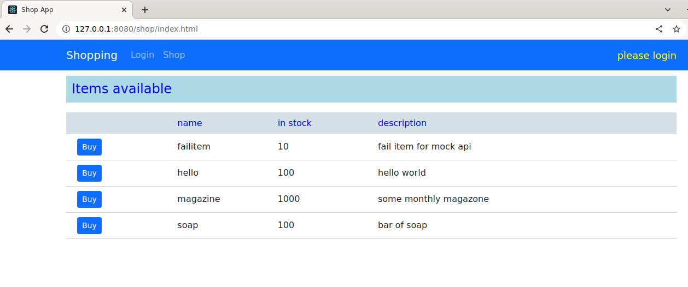
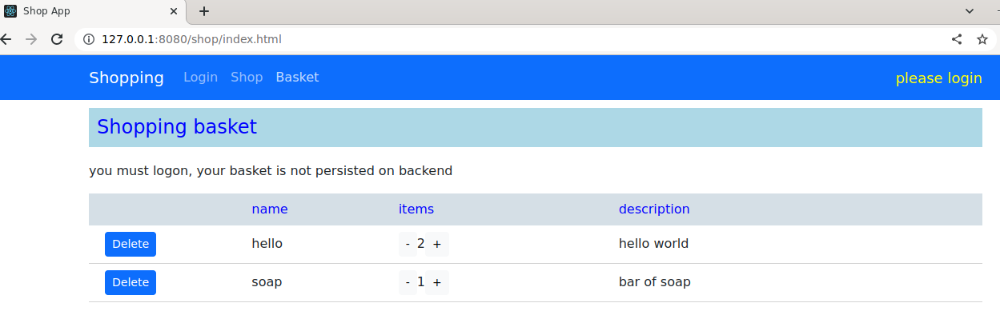
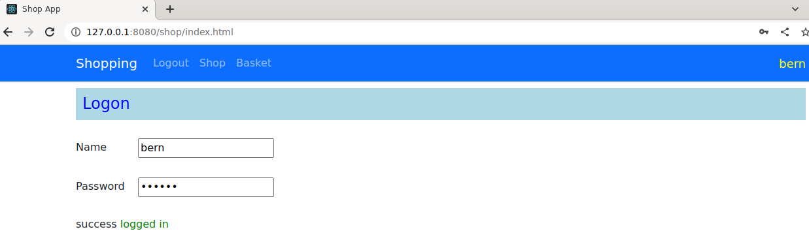
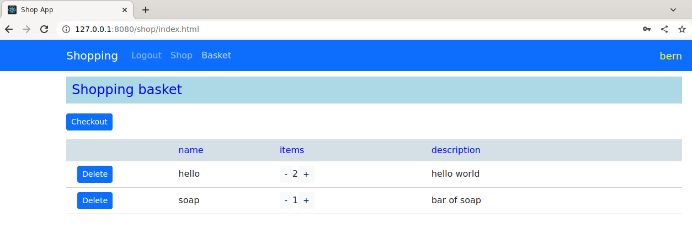
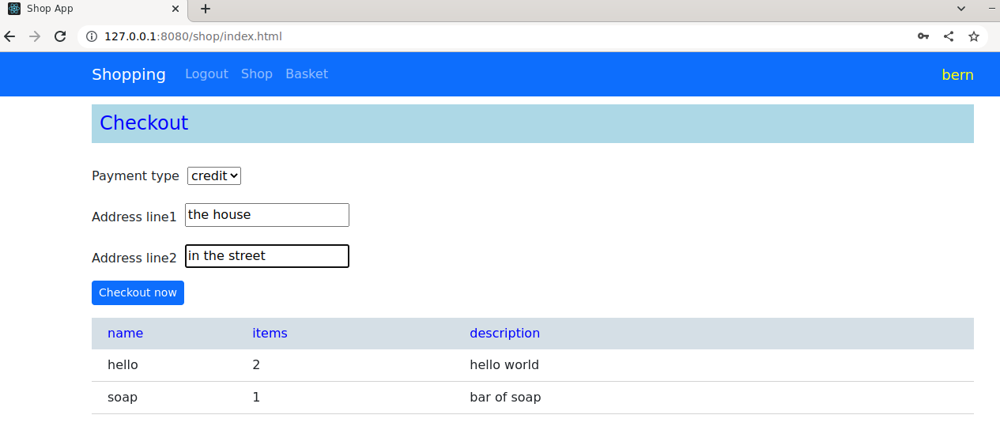
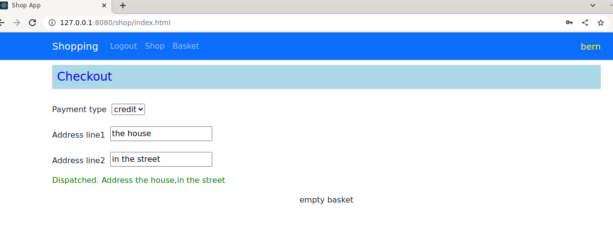

# Shop app using React and Django

Developed with Python3 and React 18.2.0. Setup uses a sqlite flat file for the DB. This is not production code!

You can buy items anonymously, log onto site, and checkout items if they are in stock.








# To start Django backend with sqlite DB and React front end

To get React dev to use Django change package.json proxy to
```
proxy": "http://localhost:8000
```

## setup Django

Create a virtualenv and load dependencies.

```
cd backend
python3.9 -m venv venvshop
source venvshop/bin/activate
pip install -r requirements.txt
```
If using Windows, difference in setting up environment variables
```
venvshop/Script/activate
```

## start Django backend
```
source venvshop/bin/activate
cd shopapp
python manage.py runserver
```

## start the React app in development mode
to run React website in development mode 

You may need to install npm if it isn't on your system, for example on ubuntu
```
sudo apt-get install npm
```

Then from cloned directory setup
```
npm install
```

Start the development webserver
```
npm start
```

go to http://127.0.0.1:3000

There are 2 users configured for the shop application, usernames are

- bern

- jason

the password for both is any string of more than 2 character

# Deploy using Docker

the project can be run in a Docker container, with Apache wsgi fronting Django.

Steps are to package React first, generating html/js. Then build the Docker container

```
npm run build
docker build -t shop .
docker run --rm --network host -d --name shop shop 
```

The Docker container will start an Apache http webserver hosting the static website. It will also connect to Django backend for API calls.
The database is still the sqlite filesystem flat file which is fine for demonstration/dev/playing.

To access running container visit http://127.0.0.1:8080

# Mock api for testing
There is a mock backend api using connect-api-mocker that can be used.

```
npm install --save-dev express connect-api-mocker
```

to start the mock api
```
node mock-api/app.js
```
Mock API Server is up and running at: http://localhost:9000

To get React dev to use this change package.json proxy to
```
proxy": "http://localhost:9000/api
```

----------------------------------------------------------------------

This project was bootstrapped with [Create React App](https://github.com/facebook/create-react-app).

## Available Scripts

In the project directory, you can run:

### `npm start`

Runs the app in the development mode.\
Open [http://localhost:3000](http://localhost:3000) to view it in your browser.

The page will reload when you make changes.\
You may also see any lint errors in the console.

### `npm test`

Launches the test runner in the interactive watch mode.\
See the section about [running tests](https://facebook.github.io/create-react-app/docs/running-tests) for more information.

### `npm run build`

Builds the app for production to the `build` folder.\
It correctly bundles React in production mode and optimizes the build for the best performance.

The build is minified and the filenames include the hashes.\
Your app is ready to be deployed!

See the section about [deployment](https://facebook.github.io/create-react-app/docs/deployment) for more information.

### Deployment

This section has moved here: [https://facebook.github.io/create-react-app/docs/deployment](https://facebook.github.io/create-react-app/docs/deployment)

### `npm run build` fails to minify

This section has moved here: [https://facebook.github.io/create-react-app/docs/troubleshooting#npm-run-build-fails-to-minify](https://facebook.github.io/create-react-app/docs/troubleshooting#npm-run-build-fails-to-minify)
